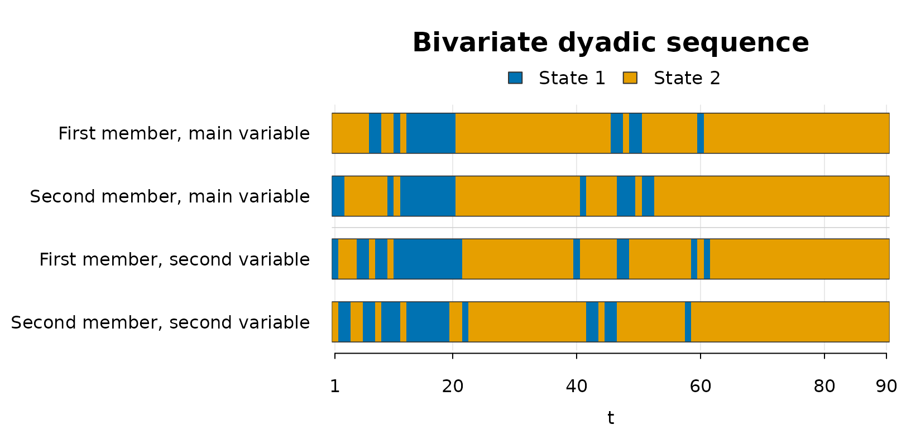

# Bivariate dyadic workflow

## Overview

This vignette shows the bivariate workflow implemented in
`dyadicMarkov`. In the bivariate setting, two categorical variables are
observed repeatedly for the two members of a dyad. The bivariate method
follows the global-and-local procedure described in Böllenrücher et al.
(in press).

The bivariate method uses matrix codes to identify the local dependence
patterns. Partial bivariate patterns are denoted B1–B3, while complete
bivariate patterns are denoted C, D1–D4, and E1–E4. When the global step
identifies a univariate case, the A-family codes described in the
univariate workflow apply. The pattern nomenclature is summarized in
Table 2 of Böllenrücher et al. (in press).

The current bivariate workflow supports binary variables (`states = 2`).

The example uses the data set `dyadic_bivariate_example` included in the
package. The data are synthetic and are used only to illustrate the
required input structure and the package workflow.

Although the data are synthetic, the four columns can be read like real
repeated observations from a dyad. For example, `V1` could represent one
coded behavior or response and `V2` a second behavior or response
observed at the same measurement occasions. The columns `FM_V1` and
`SM_V1` describe the two members on the main variable, while `FM_V2` and
`SM_V2` describe the same two members on the second variable.

## Data

The example data set `dyadic_bivariate_example` contains two categorical
variables for the first member and the second member of a dyad. Each row
corresponds to one measurement occasion.

``` r

utils::data("dyadic_bivariate_example", package = "dyadicMarkov")

head(dyadic_bivariate_example)
#>   time FM_V1 SM_V1 FM_V2 SM_V2
#> 1    1     2     1     1     2
#> 2    2     2     1     2     1
#> 3    3     2     2     2     1
#> 4    4     2     2     2     2
#> 5    5     2     2     1     2
#> 6    6     2     2     1     1
dim(dyadic_bivariate_example)
#> [1] 90  5
```

The four chains are first-member and second-member sequences for the
main variable (`V1`) and the second variable (`V2`).

``` r

table(dyadic_bivariate_example$FM_V1)
#> 
#>  1  2 
#> 16 74
table(dyadic_bivariate_example$SM_V1)
#> 
#>  1  2 
#> 18 72
table(dyadic_bivariate_example$FM_V2)
#> 
#>  1  2 
#> 21 69
table(dyadic_bivariate_example$SM_V2)
#> 
#>  1  2 
#> 20 70
```

## Empirical bivariate transition counts

[`countEmpBivariate()`](https://boellenruecherm.github.io/dyadicMarkov-public/reference/countEmpBivariate.md)
computes the empirical transition counts for the first member on the
main variable from the four observed sequences.

For `states = 2`, the resulting matrix has 16 rows corresponding to the
possible previous-state combinations of both members on both variables.
With four binary lagged components, there are \\2^4 = 16\\ such
combinations. The two columns correspond to the possible next states of
the first member on the main variable.

The returned `dyadic_counts` object retains ordinary matrix behavior and
provides [`print()`](https://rdrr.io/r/base/print.html),
[`summary()`](https://rdrr.io/r/base/summary.html), and
[`utils::toLatex()`](https://rdrr.io/r/utils/toLatex.html) methods. The
[`summary()`](https://rdrr.io/r/base/summary.html) method reports
information including the matrix dimensions, total count, and row sums,
while `utils::toLatex(emp_bi)` produces a LaTeX representation for
reports or manuscripts.

``` r

emp_bi <- dyadicMarkov::countEmpBivariate(
  chainFM_V1 = dyadic_bivariate_example$FM_V1,
  chainSM_V1 = dyadic_bivariate_example$SM_V1,
  chainFM_V2 = dyadic_bivariate_example$FM_V2,
  chainSM_V2 = dyadic_bivariate_example$SM_V2,
  states = 2L
)

print(emp_bi)
#>                                     next_1 next_2
#> mainFM1_mainSM1_secondFM1_secondSM1 7      0     
#> mainFM1_mainSM1_secondFM1_secondSM2 0      2     
#> mainFM1_mainSM1_secondFM2_secondSM1 0      0     
#> mainFM1_mainSM1_secondFM2_secondSM2 1      0     
#> mainFM1_mainSM2_secondFM1_secondSM1 0      1     
#> mainFM1_mainSM2_secondFM1_secondSM2 0      1     
#> mainFM1_mainSM2_secondFM2_secondSM1 2      0     
#> mainFM1_mainSM2_secondFM2_secondSM2 0      2     
#> mainFM2_mainSM1_secondFM1_secondSM1 0      0     
#> mainFM2_mainSM1_secondFM1_secondSM2 2      1     
#> mainFM2_mainSM1_secondFM2_secondSM1 1      1     
#> mainFM2_mainSM1_secondFM2_secondSM2 0      3     
#> mainFM2_mainSM2_secondFM1_secondSM1 1      1     
#> mainFM2_mainSM2_secondFM1_secondSM2 1      4     
#> mainFM2_mainSM2_secondFM2_secondSM1 1      5     
#> mainFM2_mainSM2_secondFM2_secondSM2 0      52
summary(emp_bi)
#> $object_type
#> [1] "empirical transition counts"
#> 
#> $object_class
#> [1] "dyadic_counts" "matrix"        "array"        
#> 
#> $storage_mode
#> [1] "integer"
#> 
#> $dimensions
#> [1] 16  2
#> 
#> $row_names
#>  [1] "mainFM1_mainSM1_secondFM1_secondSM1" "mainFM1_mainSM1_secondFM1_secondSM2"
#>  [3] "mainFM1_mainSM1_secondFM2_secondSM1" "mainFM1_mainSM1_secondFM2_secondSM2"
#>  [5] "mainFM1_mainSM2_secondFM1_secondSM1" "mainFM1_mainSM2_secondFM1_secondSM2"
#>  [7] "mainFM1_mainSM2_secondFM2_secondSM1" "mainFM1_mainSM2_secondFM2_secondSM2"
#>  [9] "mainFM2_mainSM1_secondFM1_secondSM1" "mainFM2_mainSM1_secondFM1_secondSM2"
#> [11] "mainFM2_mainSM1_secondFM2_secondSM1" "mainFM2_mainSM1_secondFM2_secondSM2"
#> [13] "mainFM2_mainSM2_secondFM1_secondSM1" "mainFM2_mainSM2_secondFM1_secondSM2"
#> [15] "mainFM2_mainSM2_secondFM2_secondSM1" "mainFM2_mainSM2_secondFM2_secondSM2"
#> 
#> $column_names
#> [1] "next_1" "next_2"
#> 
#> $total_count
#> [1] 89
#> 
#> $row_sums
#> mainFM1_mainSM1_secondFM1_secondSM1 mainFM1_mainSM1_secondFM1_secondSM2 
#>                                   7                                   2 
#> mainFM1_mainSM1_secondFM2_secondSM1 mainFM1_mainSM1_secondFM2_secondSM2 
#>                                   0                                   1 
#> mainFM1_mainSM2_secondFM1_secondSM1 mainFM1_mainSM2_secondFM1_secondSM2 
#>                                   1                                   1 
#> mainFM1_mainSM2_secondFM2_secondSM1 mainFM1_mainSM2_secondFM2_secondSM2 
#>                                   2                                   2 
#> mainFM2_mainSM1_secondFM1_secondSM1 mainFM2_mainSM1_secondFM1_secondSM2 
#>                                   0                                   3 
#> mainFM2_mainSM1_secondFM2_secondSM1 mainFM2_mainSM1_secondFM2_secondSM2 
#>                                   2                                   3 
#> mainFM2_mainSM2_secondFM1_secondSM1 mainFM2_mainSM2_secondFM1_secondSM2 
#>                                   2                                   5 
#> mainFM2_mainSM2_secondFM2_secondSM1 mainFM2_mainSM2_secondFM2_secondSM2 
#>                                   6                                  52 
#> 
#> attr(,"class")
#> [1] "summary_dyadic_counts" "list"
```

## Global bivariate case

[`bivariateCase()`](https://boellenruecherm.github.io/dyadicMarkov-public/reference/bivariateCase.md)
performs the global step of the bivariate method. The global approach
compares nested models within the Likelihood-Ratio Test (LRT) framework.
The function performs two comparisons involving the actor-partner
pattern A1 and the partial actor-partner pattern B1. `dyadicMarkov`
evaluates these comparisons using Pearson’s chi-squared statistic, \\X^2
= \sum (O-E)^2/E\\, to classify the analyzed sequence as a trivial,
univariate, partial bivariate, or complete bivariate case.

The returned `dyadic_case` object provides
[`print()`](https://rdrr.io/r/base/print.html),
[`summary()`](https://rdrr.io/r/base/summary.html), and
[`plot()`](https://rdrr.io/r/graphics/plot.default.html) methods. The
printed output gives the identified global case,
[`summary()`](https://rdrr.io/r/base/summary.html) reports the test
results and decisions at the specified significance level, and
[`plot()`](https://rdrr.io/r/graphics/plot.default.html) displays the
observed categorical sequences. Individual components can also be
accessed directly through the list-like object, including
`case_bi$case`.

``` r

case_bi <- dyadicMarkov::bivariateCase(emp_bi, alpha = 0.05)

print(case_bi)
#> Bivariate dyadic case
#> Case: complete
#> Alpha: 0.05
summary(case_bi)
#> Bivariate case summary
#> Case: complete
#> Alpha: 0.05
#> 
#> Global comparisons evaluated with Pearson Chi-squared
#> 
#>  Model                           Chi-squared df   p-value Decision
#>  Main-variable-only model (A1)   35.6          12 <0.001  Rejected
#>  Second-variable-only model (B1) 72.9          12 <0.001  Rejected
plot(case_bi)
```



This example is identified as a complete bivariate case. The appropriate
local step is therefore to compare complete bivariate candidate
patterns.

## Local pattern identification for a complete case

For a complete bivariate case,
[`completePattern()`](https://boellenruecherm.github.io/dyadicMarkov-public/reference/completePattern.md)
computes the G-squared deviance, \\G^2 = 2\sum O\log(O/E)\\, for each
complete bivariate candidate structure. It then calculates \\AIC = G^2 +
2k\\ and selects the candidate with the smallest AIC.

The returned `dyadic_pattern` object provides
[`print()`](https://rdrr.io/r/base/print.html),
[`summary()`](https://rdrr.io/r/base/summary.html), and
[`plot()`](https://rdrr.io/r/graphics/plot.default.html) methods. The
printed output gives the selected pattern,
[`summary()`](https://rdrr.io/r/base/summary.html) reports the candidate
comparison, and [`plot()`](https://rdrr.io/r/graphics/plot.default.html)
displays the observed categorical sequences. Individual components such
as `complete_bi$pattern` and `complete_bi$aic` can also be accessed
directly.

``` r

complete_bi <- dyadicMarkov::completePattern(emp_bi)

print(complete_bi)
#> Dyadic interaction pattern
#> Pattern: actor only on the main, actor-partner on the second (D2)
summary(complete_bi)
#> Dyadic interaction pattern summary
#> Selected pattern: actor only on the main, actor-partner on the second (D2)
#> 
#> AIC candidate comparison
#> 
#>  Matrix AIC  Delta AIC Selected
#>  C        32 3.57              
#>  D1       30 1.61              
#>  D2     28.4 0         Yes     
#>  D3     33.3 4.91              
#>  D4     38.6 10.2              
#>  E1     30.6 2.13              
#>  E2     42.9 14.5              
#>  E3     36.5 8.05              
#>  E4     40.6 12.1
plot(complete_bi)
```


In this example, the selected complete bivariate pattern is `D2`,
labelled by the package as actor only on the main, actor-partner on the
second.

## Repeating the analysis from each perspective

Each bivariate analysis is defined from a particular member and variable
perspective. The sequence supplied as the first member is the sequence
being analyzed, while the second member supplies the partner sequence.
Likewise, one variable is treated as the main variable and the other as
the second variable.

Swapping the two members changes the member perspective, while swapping
the two variables changes which variable is treated as the main
variable. The workflow can therefore be repeated for each combination of
analyzed member and main variable. These are distinct analyses and may
lead to different global cases and local patterns.

For compactness, the following vignette-local helper applies the
exported functions in sequence. Like
[`completePattern()`](https://boellenruecherm.github.io/dyadicMarkov-public/reference/completePattern.md),
[`partialPattern()`](https://boellenruecherm.github.io/dyadicMarkov-public/reference/partialPattern.md)
returns a `dyadic_pattern` object providing
[`print()`](https://rdrr.io/r/base/print.html),
[`summary()`](https://rdrr.io/r/base/summary.html), and
[`plot()`](https://rdrr.io/r/graphics/plot.default.html) methods.
`analyze_bivariate()` is defined only for this vignette and is not part
of the package API.

``` r

analyze_bivariate <- function(label, fm_v1, sm_v1, fm_v2, sm_v2) {
  emp <- dyadicMarkov::countEmpBivariate(
    chainFM_V1 = fm_v1,
    chainSM_V1 = sm_v1,
    chainFM_V2 = fm_v2,
    chainSM_V2 = sm_v2,
    states = 2L
  )

  case <- dyadicMarkov::bivariateCase(emp, alpha = 0.05)

  cat("\n", label, "\n", sep = "")
  print(case)

  if (identical(case$case, "complete")) {
    print(dyadicMarkov::completePattern(emp))
  }

  if (identical(case$case, "partial")) {
    print(dyadicMarkov::partialPattern(emp))
  }

  if (identical(case$case, "univariate")) {
    print(dyadicMarkov::univariatePattern(fm_v1, sm_v1, states = 2L, alpha = 0.05))
  }
}

d <- dyadic_bivariate_example

analyze_bivariate(
  "FM_V1 as analyzed sequence, V1 as main variable",
  d$FM_V1, d$SM_V1, d$FM_V2, d$SM_V2
)
#> 
#> FM_V1 as analyzed sequence, V1 as main variable
#> Bivariate dyadic case
#> Case: complete
#> Alpha: 0.05
#> Dyadic interaction pattern
#> Pattern: actor only on the main, actor-partner on the second (D2)

analyze_bivariate(
  "SM_V1 as analyzed sequence, V1 as main variable",
  d$SM_V1, d$FM_V1, d$SM_V2, d$FM_V2
)
#> 
#> SM_V1 as analyzed sequence, V1 as main variable
#> Bivariate dyadic case
#> Case: complete
#> Alpha: 0.05
#> Dyadic interaction pattern
#> Pattern: actor-partner on the main, partner only on the second (D3)

analyze_bivariate(
  "FM_V2 as analyzed sequence, V2 as main variable",
  d$FM_V2, d$SM_V2, d$FM_V1, d$SM_V1
)
#> 
#> FM_V2 as analyzed sequence, V2 as main variable
#> Bivariate dyadic case
#> Case: partial
#> Alpha: 0.05
#> Dyadic interaction pattern
#> Pattern: partial actor only (B2)

analyze_bivariate(
  "SM_V2 as analyzed sequence, V2 as main variable",
  d$SM_V2, d$FM_V2, d$SM_V1, d$FM_V1
)
#> 
#> SM_V2 as analyzed sequence, V2 as main variable
#> Bivariate dyadic case
#> Case: univariate
#> Alpha: 0.05
#> Dyadic interaction pattern
#> Pattern: APM (A1)
#> Alpha: 0.05
#> States: 2
```

For this example, analyzing the four sequences in turn illustrates three
branches of the procedure: complete bivariate cases when `FM_V1` and
`SM_V1` are analyzed, a partial bivariate case for `FM_V2`, and a
univariate case for `SM_V2`.

## Reading the global and local steps together

The global and local steps use different statistics.
[`bivariateCase()`](https://boellenruecherm.github.io/dyadicMarkov-public/reference/bivariateCase.md)
performs the global comparisons using Pearson’s chi-squared statistic,
\\X^2\\, whereas
[`partialPattern()`](https://boellenruecherm.github.io/dyadicMarkov-public/reference/partialPattern.md)
and
[`completePattern()`](https://boellenruecherm.github.io/dyadicMarkov-public/reference/completePattern.md)
use the G-squared deviance, \\G^2\\, to calculate candidate AIC values.

The global result determines the next step. A `trivial` case requires no
local pattern selection. A `univariate` case is analyzed with
[`univariatePattern()`](https://boellenruecherm.github.io/dyadicMarkov-public/reference/univariatePattern.md)
using the two member sequences of the current main variable. A `partial`
case proceeds to
[`partialPattern()`](https://boellenruecherm.github.io/dyadicMarkov-public/reference/partialPattern.md),
and a `complete` case proceeds to
[`completePattern()`](https://boellenruecherm.github.io/dyadicMarkov-public/reference/completePattern.md).

For complementary visualization and clustering of dyadic longitudinal
sequences, see Bollenrücher et al. (2024).

## References

Bollenrücher, Mégane, Joëlle Darwiche, and Jean-Philippe Antonietti.
2024. “Methodology for Identification, Visualization, and Clustering of
Similar Behaviors in Dyadic Sequences Analyzed Through the Longitudinal
Actor-Partner Interdependence Model with Markov Chains.” *The
Quantitative Methods for Psychology* 20 (1): 17–32.
<https://doi.org/10.20982/tqmp.20.1.p017>.

Böllenrücher, Mégane, Joëlle Darwiche, and Jean-Philippe Antonietti. in
press. “Bivariate Dyadic Patterns Analysis Using Longitudinal
Actor-Partner Interdependence Model and Markov Chains for Single-Case.”
*Quantitative and Computational Methods in Behavioral Sciences*, ahead
of print, in press. <https://doi.org/10.23668/psycharchives.22174>.
