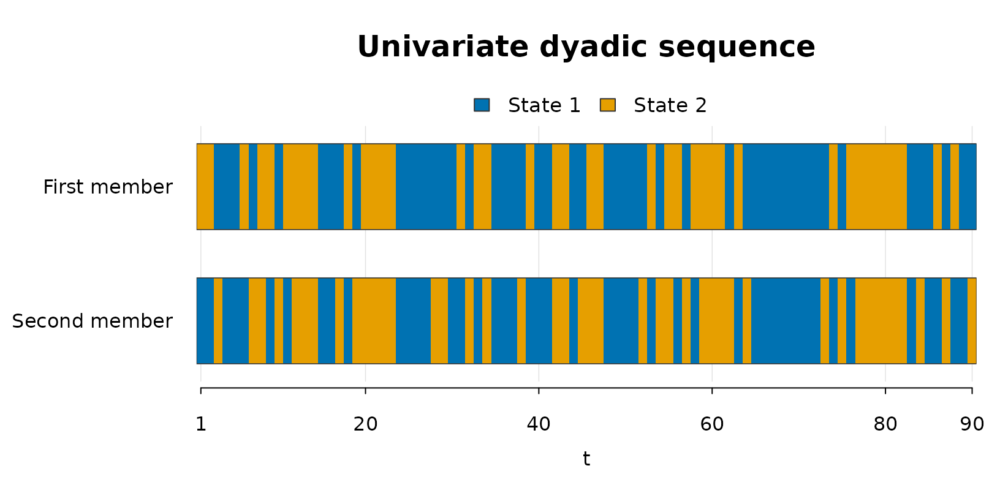

# Univariate dyadic workflow

## Overview

This vignette shows the univariate workflow implemented in
`dyadicMarkov`. In the univariate setting, one categorical variable is
observed repeatedly for the two members of a dyad. The workflow follows
the single-case method described in Bollenrücher et al. (2023):
empirical transition counts are computed from the dyadic sequence,
transition probabilities are estimated by maximum likelihood, and
restricted actor/partner structures are compared to identify the pattern
of interaction.

The example uses the data set `dyadic_univariate_example` included in
the package. The data are synthetic and are used only to illustrate the
required input structure and the package workflow.

Although the data are synthetic, the two columns can be read like real
ordered observations from a dyad. For example, `FM` and `SM` could
represent two partners, a parent and child, a therapist and client, or
any two interacting members observed at repeated occasions. The integer
states represent coded categories of a behavior or response. In a binary
application, `state 1` and `state 2` could represent absence and
presence of a coded behavior, two interaction states, or two response
categories defined by the researcher.

## Data

The univariate example contains one categorical variable for the first
member (`FM`) and the second member (`SM`) of a dyad. Each row
corresponds to one measurement occasion. In the first analysis, the
sequence of `FM`, the first member, is analyzed; `SM` is the second
member or partner.

``` r

# Load the example data included with dyadicMarkov
utils::data("dyadic_univariate_example", package = "dyadicMarkov")

head(dyadic_univariate_example)
#>   time FM SM
#> 1    1  2  1
#> 2    2  2  1
#> 3    3  1  2
#> 4    4  1  1
#> 5    5  1  1
#> 6    6  2  1
dim(dyadic_univariate_example)
#> [1] 90  3
```

In this example, the categorical states are coded as 1 and 2 for both
members.

``` r

table(dyadic_univariate_example$FM)
#> 
#>  1  2 
#> 50 40
table(dyadic_univariate_example$SM)
#> 
#>  1  2 
#> 47 43
```

## Empirical transition counts

[`countEmp()`](https://boellenruecherm.github.io/dyadicMarkov-public/reference/countEmp.md)
computes the empirical transition counts for the first member from the
two observed dyadic sequences. For `states = 2`, the resulting matrix
has four rows corresponding to the possible previous dyadic states
\\(FM_t, SM_t)\\ and two columns corresponding to the possible next
states of the first member, \\FM\_{t+1}\\. The returned `dyadic_counts`
object retains ordinary matrix behavior and provides
[`print()`](https://rdrr.io/r/base/print.html),
[`summary()`](https://rdrr.io/r/base/summary.html), and
[`utils::toLatex()`](https://rdrr.io/r/utils/toLatex.html) methods. The
[`summary()`](https://rdrr.io/r/base/summary.html) method reports
information including the matrix dimensions, total count, and row sums,
while `utils::toLatex(emp_uni)` produces a LaTeX representation for
reports or manuscripts.

``` r

emp_uni <- dyadicMarkov::countEmp(
  chainFM = dyadic_univariate_example$FM,
  chainSM = dyadic_univariate_example$SM,
  states = 2L
)

print(emp_uni)
#>         next_1 next_2
#> FM1_SM1 26     4     
#> FM1_SM2 5      14    
#> FM2_SM1 12     5     
#> FM2_SM2 7      16
summary(emp_uni)
#> $object_type
#> [1] "empirical transition counts"
#> 
#> $object_class
#> [1] "dyadic_counts" "matrix"        "array"        
#> 
#> $storage_mode
#> [1] "integer"
#> 
#> $dimensions
#> [1] 4 2
#> 
#> $row_names
#> [1] "FM1_SM1" "FM1_SM2" "FM2_SM1" "FM2_SM2"
#> 
#> $column_names
#> [1] "next_1" "next_2"
#> 
#> $total_count
#> [1] 89
#> 
#> $row_sums
#> FM1_SM1 FM1_SM2 FM2_SM1 FM2_SM2 
#>      30      19      17      23 
#> 
#> attr(,"class")
#> [1] "summary_dyadic_counts" "list"
```

## Maximum-likelihood transition probabilities

The empirical counts are converted into estimated transition
probabilities with
[`mleEstimation()`](https://boellenruecherm.github.io/dyadicMarkov-public/reference/mleEstimation.md).
For each previous-state combination that is observed in the data, the
corresponding row of counts is divided by its row total so that the
estimated transition probabilities sum to one.

If a previous-state combination is never observed, its row total is zero
and there is therefore no information in the data from which to estimate
its transition probabilities. In this case, `dyadicMarkov` returns equal
probabilities for all possible next states as an implementation
convention.

The returned `dyadic_mle` object retains ordinary matrix behavior and
provides [`print()`](https://rdrr.io/r/base/print.html),
[`summary()`](https://rdrr.io/r/base/summary.html), and
[`utils::toLatex()`](https://rdrr.io/r/utils/toLatex.html) methods. The
[`summary()`](https://rdrr.io/r/base/summary.html) method reports the
matrix structure and row sums, while `utils::toLatex(fit_uni)` produces
a LaTeX representation of the estimated transition matrix.

``` r

fit_uni <- dyadicMarkov::mleEstimation(emp_uni)

print(fit_uni)
#>         next_1 next_2
#> FM1_SM1 0.867  0.133 
#> FM1_SM2 0.263  0.737 
#> FM2_SM1 0.706  0.294 
#> FM2_SM2 0.304  0.696
summary(fit_uni)
#> $object_type
#> [1] "transition probability estimates"
#> 
#> $object_class
#> [1] "dyadic_mle" "matrix"     "array"     
#> 
#> $storage_mode
#> [1] "double"
#> 
#> $dimensions
#> [1] 4 2
#> 
#> $row_names
#> [1] "FM1_SM1" "FM1_SM2" "FM2_SM1" "FM2_SM2"
#> 
#> $column_names
#> [1] "next_1" "next_2"
#> 
#> $row_sums
#> FM1_SM1 FM1_SM2 FM2_SM1 FM2_SM2 
#>       1       1       1       1 
#> 
#> attr(,"class")
#> [1] "summary_dyadic_mle" "list"
```

## Univariate pattern identification

The univariate method uses the A-family matrix codes for its dependence
patterns: A1 denotes actor-partner, A2 actor only, and A3 partner only.
The pattern nomenclature is summarized in Table 2 of Böllenrücher et al.
(in press).

The function
[`univariatePattern()`](https://boellenruecherm.github.io/dyadicMarkov-public/reference/univariatePattern.md)
implements the univariate Likelihood-Ratio Test (LRT) procedure. It
compares the unrestricted actor-partner structure with actor-only and
partner-only restricted structures. `dyadicMarkov` evaluates these
comparisons using Pearson’s chi-squared statistic, \\X^2 = \sum
(O-E)^2/E\\. The two test outcomes are then combined to classify the
sequence as actor-partner, actor only, partner only, or independence.

The returned `dyadic_pattern` object contains the selected interaction
pattern and the corresponding test results and provides
[`print()`](https://rdrr.io/r/base/print.html),
[`summary()`](https://rdrr.io/r/base/summary.html), and
[`plot()`](https://rdrr.io/r/graphics/plot.default.html) methods. The
printed output gives the selected pattern,
[`summary()`](https://rdrr.io/r/base/summary.html) reports the two
restriction tests and their decisions at the specified significance
level, and [`plot()`](https://rdrr.io/r/graphics/plot.default.html)
displays the observed categorical sequences of the two members.
Individual components can also be accessed directly, including
`pat_uni$pattern`, `pat_uni$TEST.AM`, and `pat_uni$TEST.PM`.

``` r

pat_uni <- dyadicMarkov::univariatePattern(
  chainFM = dyadic_univariate_example$FM,
  chainSM = dyadic_univariate_example$SM,
  states = 2L,
  alpha = 0.05
)

print(pat_uni)
#> Dyadic interaction pattern
#> Pattern: PM (A3)
#> Alpha: 0.05
#> States: 2
summary(pat_uni)
#> Dyadic interaction pattern summary
#> Pattern: PM (A3)
#> Alpha: 0.05
#> States: 2
#> 
#> Likelihood-ratio comparisons evaluated with Pearson Chi-squared
#> 
#>  Restriction                       Chi-squared df   p-value Decision    
#>  AM (A2): actor-only restriction   24.6           2 <0.001  Rejected    
#>  PM (A3): partner-only restriction  1.9           2 0.387   Not rejected
plot(pat_uni)
```



## Interpretation

In this example, the selected pattern is `PM (A3)`. This indicates that
the previous state of the second member is retained in the restricted
structure, whereas the previous state of the first member is not
retained. In the terminology of the univariate method, this corresponds
to a partner-only pattern.

The result should be interpreted as a pattern description for the
analyzed sequence. The function call above analyzes the sequence of
`FM`, the first member, with `SM` as the second member or partner.
Reversing the two arguments analyzes the sequence from the perspective
of the second member. Thus, describing both members of a dyad requires
two calls, and each returned pattern is specific to the analyzed
sequence.

``` r

pat_uni_reverse <- dyadicMarkov::univariatePattern(
  chainFM = dyadic_univariate_example$SM,
  chainSM = dyadic_univariate_example$FM,
  states = 2L,
  alpha = 0.05
)

pat_uni_reverse
#> Dyadic interaction pattern
#> Pattern: PM (A3)
#> Alpha: 0.05
#> States: 2
```

In this example, reversing the two members also returns `PM (A3)`, but
this does not occur in general: each call describes the pattern of the
sequence supplied as the first member, conditional on the sequence
supplied as the second member. For a complementary approach to
visualization and clustering of dyadic longitudinal sequences, see
Bollenrücher et al. (2024).

## References

Bollenrücher, Mégane, Joëlle Darwiche, and Jean-Philippe Antonietti.
2023. “Dyadic Pattern Analysis Using Longitudinal Actor-Partner
Interdependence Model with Markov Chains for Unique Case Analysis.” *The
Quantitative Methods for Psychology* 19 (3): 230–43.
<https://doi.org/10.20982/tqmp.19.3.p230>.

Bollenrücher, Mégane, Joëlle Darwiche, and Jean-Philippe Antonietti.
2024. “Methodology for Identification, Visualization, and Clustering of
Similar Behaviors in Dyadic Sequences Analyzed Through the Longitudinal
Actor-Partner Interdependence Model with Markov Chains.” *The
Quantitative Methods for Psychology* 20 (1): 17–32.
<https://doi.org/10.20982/tqmp.20.1.p017>.

Böllenrücher, Mégane, Joëlle Darwiche, and Jean-Philippe Antonietti. in
press. “Bivariate Dyadic Patterns Analysis Using Longitudinal
Actor-Partner Interdependence Model and Markov Chains for Single-Case.”
*Quantitative and Computational Methods in Behavioral Sciences*, ahead
of print, in press. <https://doi.org/10.23668/psycharchives.22174>.
